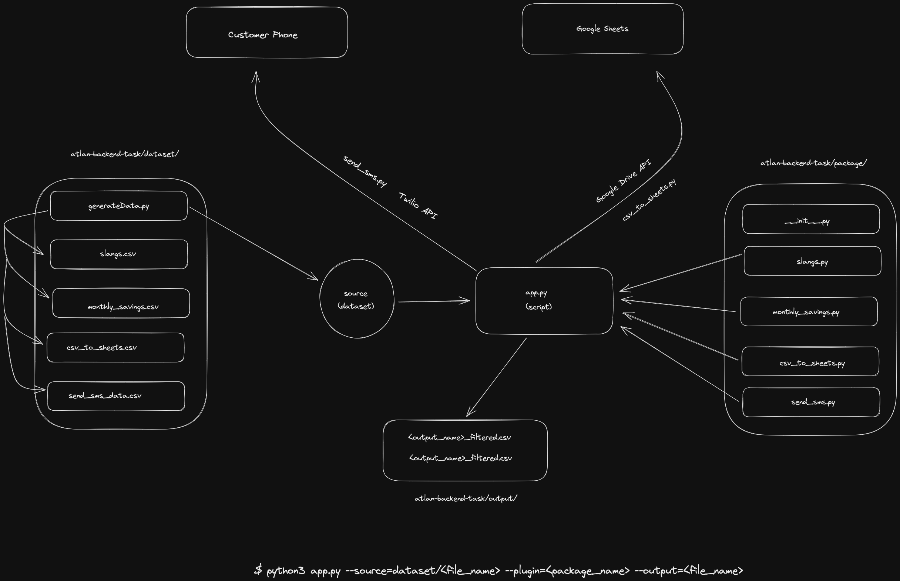

# Atlan Backend Assessment

## Description

Hi everyone @ Atlan. :wave:, This is my **Backend assessment**.

# Problem Statement:

There were 4 problem statements assigned and all the those tasks were designed specifically. To implement **plug-n-play** behaviour I opted to make packages for each task so that they can be easily called anywhere inside the project folder because it contains an `__init__.py` file which tells _Python_ that it is a package.

### Dataset

The data for demo purposes has been genereated using `Faker` package in `/dataset/generate_data.py`.

# Explaination

1. Problem 1: `slangs.slangsFunc` is called in the `app.py` file and in that function we are reading a dataset and going through each row at a time and checking for slangs so that they can be stored. The function is not created with as such requirements becuse of less information provided. I have made a basic function to search for words ending with the letter `'n'` and storing only those in a new directory `/output/{name_given}.csv` in this case `/output/slangs_filtered.csv`.

2. Problem 2: An `MONTLY_INCOME=[int]` is assigned in this package which can be changed as desired in future and a loop is implemented so that employees with monthly savings greater than monthly income are flagged and sent back and the output is being stored in `/output/filtered_savings.csv`.

3. Problem 3: This task is to convert all their wanting data onto **Google Sheets** wherein they could connect their CRM. In this case I generated a sample dataset which is converted into **Google Sheets** using `GOOGLE DRIVE API` and linking the scopes provied in the _docs_. The `client_secret.json` is the credentials to access the API and write all the data onto `Google Drive` in _sheets_.
   `client_secret.json` will be changed according to production settings

```console
    $ pip install gspread
    $ pip install oauth2client
```

4. Problem 4: Sending SMS response back to customers who participated in their data drive, I used a basic loop and used `Twilio` in this case to send a response back to respective customer's contact number.
   > _Thank you for participating in the data drive ~ Atlan_.

# Pipeline workflow



# Installation

```console
$ git clone https://github.com/shiyanshirani/atlan-backend-task
$ pip3 install -r requirements
```

### Create dataset or use the provided `/dataset/<sample_dataset>/`

_<data_set_name>_ = csv_to_sheets, slangs, montly_savings, send_sms_data

```console
$ python3 generate.py --data=<data_set_name>
```

Run the script in `atlan-backend-task/app.py`

### Flags

- --source = `dataset/slangs.csv`, _dataset to be used_.
- --plugin = `slangs`, _plugin to be used on dataset_.
- --output = `filtered_slangs` , _new file name._

```console
$ python3 app.py --source=<dataset_path> --plugin=<package> --output=<new_filename>
```

# Testing

This script has been tested on 10,000 dataset and running smoothly.
